# Полный анализ архитектуры и логики работы Xiaomi Air Purifier NG

## Содержание

1. [Общая архитектура](#1-общая-архитектура)
2. [Lifecycle интеграции](#2-lifecycle-интеграции)
3. [Coordinator — polling и обновление данных](#3-coordinator--polling-и-обновление-данных)
4. [Группа 1: Air Purifier (очистители воздуха)](#4-группа-1-air-purifier)
5. [Группа 2: Air Humidifier (увлажнители)](#5-группа-2-air-humidifier)
6. [Группа 3: Air Fresh (приточная вентиляция)](#6-группа-3-air-fresh)
7. [Группа 4: Standing Fan (напольные вентиляторы)](#7-группа-4-standing-fan)
8. [Группа 5: Air Dehumidifier (осушители)](#8-группа-5-air-dehumidifier)
9. [Вспомогательные entities (sensor, switch, number, select, button, binary_sensor)](#9-вспомогательные-entities)
10. [Обработка внешних изменений](#10-обработка-внешних-изменений)
11. [Открытые проблемы и архитектурные замечания](#11-открытые-проблемы-и-архитектурные-замечания)

---

## 1. Общая архитектура

### Диаграмма компонентов

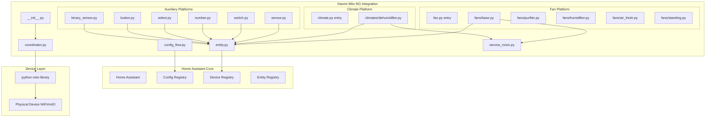

### Иерархия классов

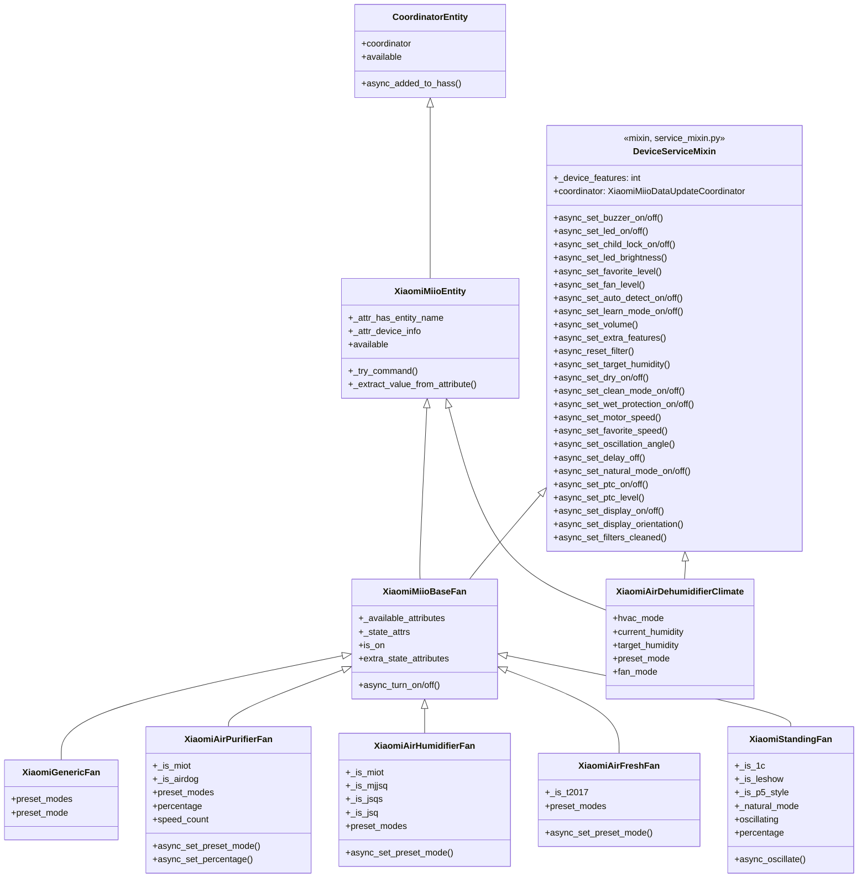

### DeviceServiceMixin (service_mixin.py)

Все 37 service-методов вынесены в единый mixin-класс `DeviceServiceMixin`. Это устраняет
дублирование кода между `XiaomiMiioBaseFan` и `XiaomiAirDehumidifierClimate`.

**Контракт mixin** — требует от host-класса:
- `_device_features: int` — битовая маска feature flags
- `_try_command(mask_error, func, *args)` — из `XiaomiMiioEntity`
- `coordinator: XiaomiMiioDataUpdateCoordinator` — из `CoordinatorEntity`

**MRO (порядок наследования):**
```python
class XiaomiMiioBaseFan(DeviceServiceMixin, XiaomiMiioEntity, FanEntity): ...
class XiaomiAirDehumidifierClimate(DeviceServiceMixin, XiaomiMiioEntity, ClimateEntity): ...
```

**Паттерн каждого метода:**
```python
async def async_set_buzzer_on(self) -> None:
    if self._device_features & FEATURE_SET_BUZZER == 0:
        return                                          # Feature not supported — silent NOP
    await self._try_command("...", self.coordinator.device.set_buzzer, True)
    await self.coordinator.async_request_refresh()      # Trigger immediate poll
```

### DeviceCategory и classify_model() (const.py)

Единый source of truth для классификации моделей по категориям:

```python
class DeviceCategory(Enum):
    PURIFIER = "purifier"
    HUMIDIFIER = "humidifier"
    AIR_FRESH = "air_fresh"
    FAN = "fan"
    DEHUMIDIFIER = "dehumidifier"
    UNKNOWN = "unknown"

def classify_model(model: str | None) -> DeviceCategory: ...
```

Используется в двух местах (вместо дублированных if/elif цепочек):
- `__init__.py:_create_coordinator()` — через `_COORDINATOR_MAP` dict lookup
- `fan.py:async_setup_entry()` — через `_FAN_ENTITY_MAP` dict lookup

### TypedDict для coordinator.data (coordinator.py)

Каждый координатор теперь типизирован:

| Координатор | TypedDict | Полей |
|-------------|-----------|-------|
| XiaomiAirPurifierCoordinator | PurifierStatusData | 32 |
| XiaomiAirHumidifierCoordinator | HumidifierStatusData | 20 |
| XiaomiFanCoordinator | FanStatusData | 22 |
| XiaomiAirFreshCoordinator | AirFreshStatusData | 27 |
| XiaomiAirDehumidifierCoordinator | DehumidifierStatusData | 13 |

Все TypedDict используют `total=False` (все поля опциональны), т.к. не каждая модель возвращает все атрибуты.

### Маппинг 52 моделей на классы

| Группа | Модели | Fan Entity | Coordinator | python-miio Device |
|--------|--------|-----------|-------------|-------------------|
| **Purifier MiOT** | 3, 3H, ZA1 | XiaomiAirPurifierFan | XiaomiAirPurifierCoordinator | AirPurifierMiot |
| **Purifier Legacy** | V1-V5, Pro, M1-M2, MA1-MA2, SA1-SA2, 2S, 2H | XiaomiAirPurifierFan | XiaomiAirPurifierCoordinator | AirPurifier |
| **Purifier Airdog** | X3, X5, X7SM | XiaomiAirPurifierFan | XiaomiAirPurifierCoordinator | AirDogX3 |
| **Humidifier MiOT** | CA4 | XiaomiAirHumidifierFan | XiaomiAirHumidifierCoordinator | AirHumidifierMiot |
| **Humidifier Zhimi** | V1, CA1, CB1, CB2 | XiaomiAirHumidifierFan | XiaomiAirHumidifierCoordinator | AirHumidifier |
| **Humidifier Deerma MJJSQ** | MJJSQ, JSQ, JSQ1 | XiaomiAirHumidifierFan | XiaomiAirHumidifierCoordinator | AirHumidifierMjjsq |
| **Humidifier Deerma JSQS** | JSQ2W, JSQ3, JSQ5, JSQS | XiaomiAirHumidifierFan | XiaomiAirHumidifierCoordinator | AirHumidifierJsqs |
| **Humidifier Shuii** | JSQ001 | XiaomiAirHumidifierFan | XiaomiAirHumidifierCoordinator | AirHumidifierJsq |
| **Air Fresh** | VA2, VA4 | XiaomiAirFreshFan | XiaomiAirFreshCoordinator | AirFresh |
| **Air Fresh A1** | A1 | XiaomiAirFreshFan | XiaomiAirFreshCoordinator | AirFreshA1 |
| **Air Fresh T2017** | T2017 | XiaomiAirFreshFan | XiaomiAirFreshCoordinator | AirFreshT2017 |
| **Fan 1C-style** | 1C, P8 | XiaomiStandingFan | XiaomiFanCoordinator | Fan1C |
| **Fan P5** | P5 | XiaomiStandingFan | XiaomiFanCoordinator | FanP5 |
| **Fan MiOT** | P9, P10, P11, P18 | XiaomiStandingFan | XiaomiFanCoordinator | FanMiot |
| **Fan Leshow** | SS4 | XiaomiStandingFan | XiaomiFanCoordinator | FanLeshow |
| **Fan Legacy** | V2, V3, SA1, ZA1, ZA3, ZA4 | XiaomiStandingFan | XiaomiFanCoordinator | Fan |
| **Dehumidifier** | nwt.derh.wdh318efw1 | XiaomiAirDehumidifierClimate | XiaomiAirDehumidifierCoordinator | AirDehumidifier |

---

## 2. Lifecycle интеграции

### Полный flow от установки до работы

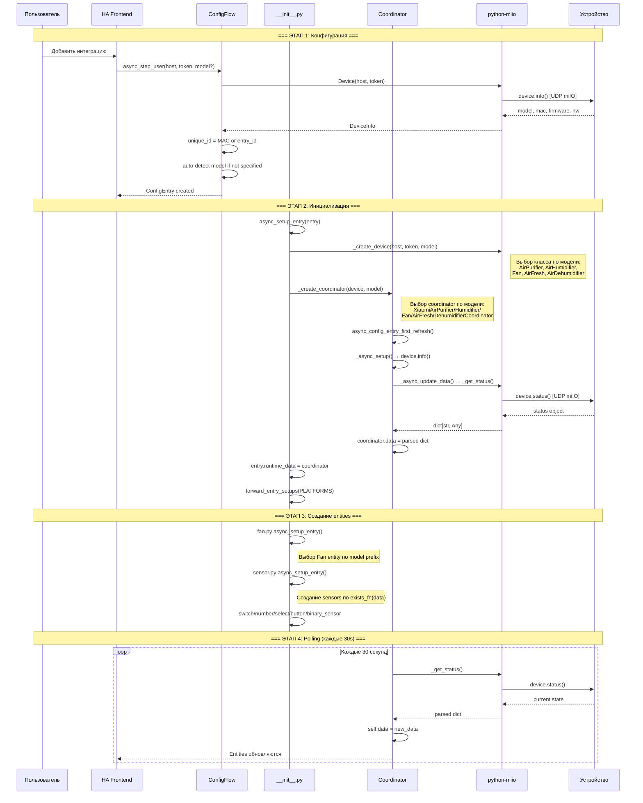

### async_setup_entry — детали

```python
# __init__.py:120-148
async def async_setup_entry(hass, entry):
    1. host, token, model = entry.data
    2. device = _create_device(host, token, model)     # sync, в executor
    3. coordinator = _create_coordinator(hass, entry, device, model)
    4. await coordinator.async_config_entry_first_refresh()  # первый poll
    5. entry.runtime_data = coordinator
    6. await forward_entry_setups(entry, PLATFORMS)     # fan, climate, sensor...
```

### Двухуровневая маршрутизация

**Уровень 1: classify_model() -> DeviceCategory** (единый source of truth в const.py)

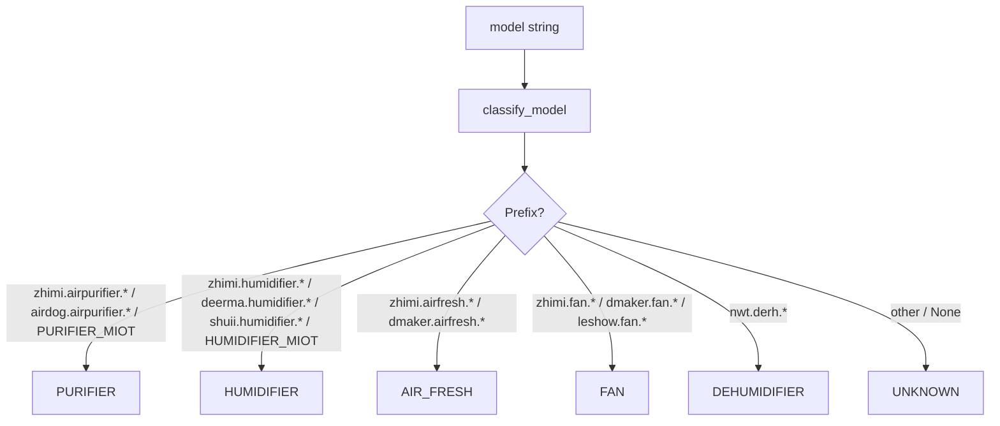

**Уровень 2a: _COORDINATOR_MAP (coordinator selection)**

```python
_COORDINATOR_MAP = {
    DeviceCategory.PURIFIER: XiaomiAirPurifierCoordinator,
    DeviceCategory.HUMIDIFIER: XiaomiAirHumidifierCoordinator,
    DeviceCategory.AIR_FRESH: XiaomiAirFreshCoordinator,
    DeviceCategory.FAN: XiaomiFanCoordinator,
    DeviceCategory.DEHUMIDIFIER: XiaomiAirDehumidifierCoordinator,
}
# UNKNOWN -> fallback XiaomiMiioDataUpdateCoordinator
```

**Уровень 2b: _FAN_ENTITY_MAP (fan entity selection)**

```python
_FAN_ENTITY_MAP = {
    DeviceCategory.PURIFIER: XiaomiAirPurifierFan,
    DeviceCategory.HUMIDIFIER: XiaomiAirHumidifierFan,
    DeviceCategory.AIR_FRESH: XiaomiAirFreshFan,
    DeviceCategory.FAN: XiaomiStandingFan,
}
# DEHUMIDIFIER -> нет fan entity (использует climate platform)
# UNKNOWN -> XiaomiGenericFan (fallback)
```

**Уровень 2c: _create_device() — выбор python-miio Device по конкретной модели**

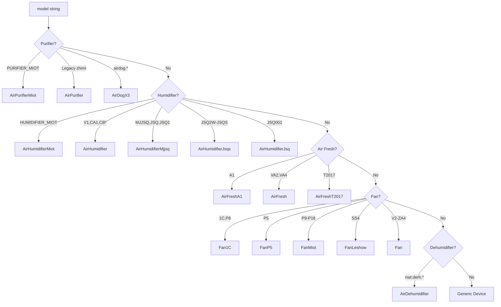

---

## 3. Coordinator — polling и обновление данных

### Архитектура координаторов

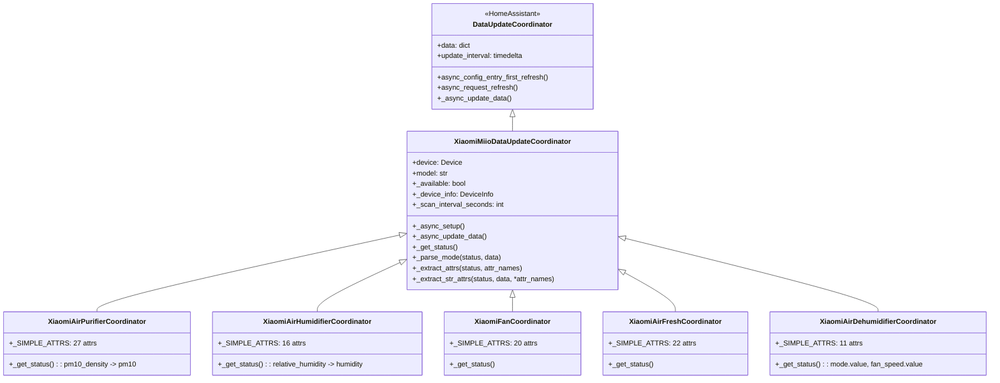

### Цикл обновления данных

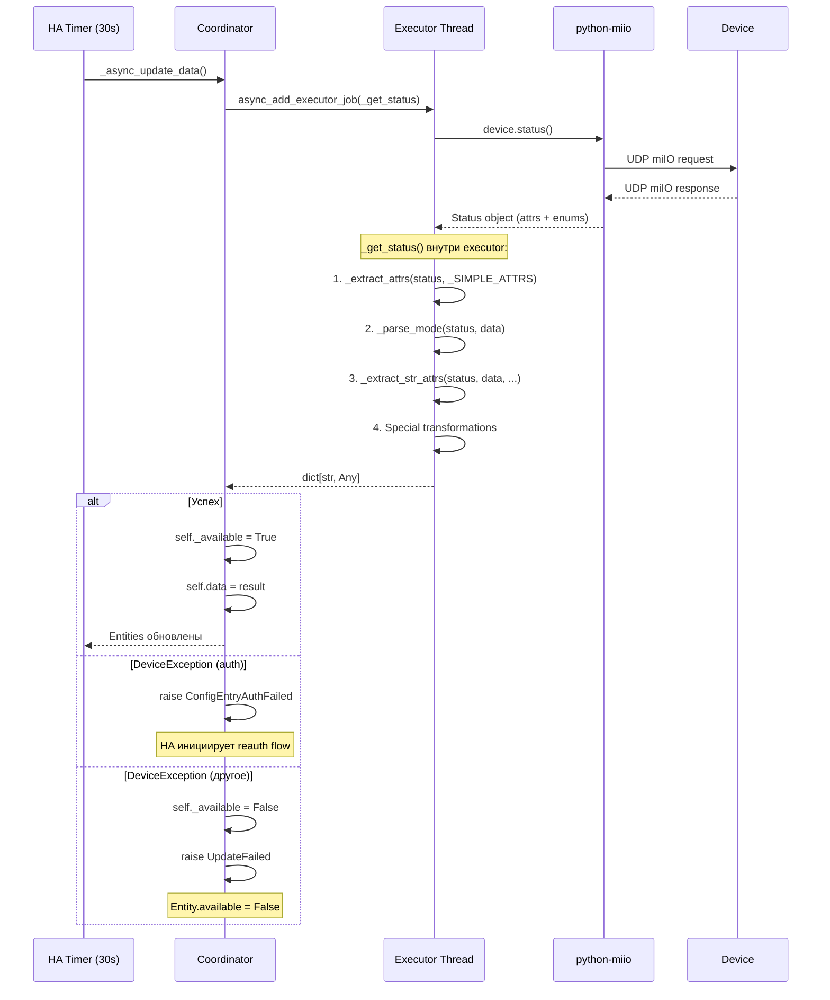

### Как _get_status() обрабатывает данные (по типам)

#### Air Purifier Coordinator

```python
# coordinator.py:171-182
_SIMPLE_ATTRS = [
    "power", "aqi", "average_aqi", "humidity", "temperature",
    "led", "buzzer", "child_lock", "favorite_level", "fan_level",
    "filter_hours_used", "filter_life_remaining", "motor_speed",
    "use_time", "purify_volume", "illuminance", "tvoc",
    "motor2_speed", "filter_rfid_tag", "filter_rfid_product_id",
    "filter_left_time", "anion", "gestures", "auto_detect",
    "learn_mode", "volume", "buzzer_volume",
]

def _get_status(self):
    status = self.device.status()
    data = self._extract_attrs(status, self._SIMPLE_ATTRS)   # dict из 27 attrs
    self._parse_mode(status, data)                            # data["mode"] = name, data["mode_value"] = int
    self._extract_str_attrs(status, data, "led_brightness", "filter_type")  # str() from enum
    if hasattr(status, "pm10_density"):
        data["pm10"] = status.pm10_density                    # Переименование!
    return data
```

#### Air Humidifier Coordinator

```python
# coordinator.py:196-210 — особенность: нормализация humidity
if hasattr(status, "humidity"):
    data["humidity"] = status.humidity
elif hasattr(status, "relative_humidity"):    # JSQS модели
    data["humidity"] = status.relative_humidity
```

#### Air Dehumidifier Coordinator (ОТЛИЧИЕ!)

```python
# coordinator.py:270-287 — использует .value вместо .name
data["mode"] = status.mode.value        # int! Не name!
data["fan_speed"] = status.fan_speed.value  # int! Не name!
```

### _parse_mode vs Dehumidifier — ключевое различие

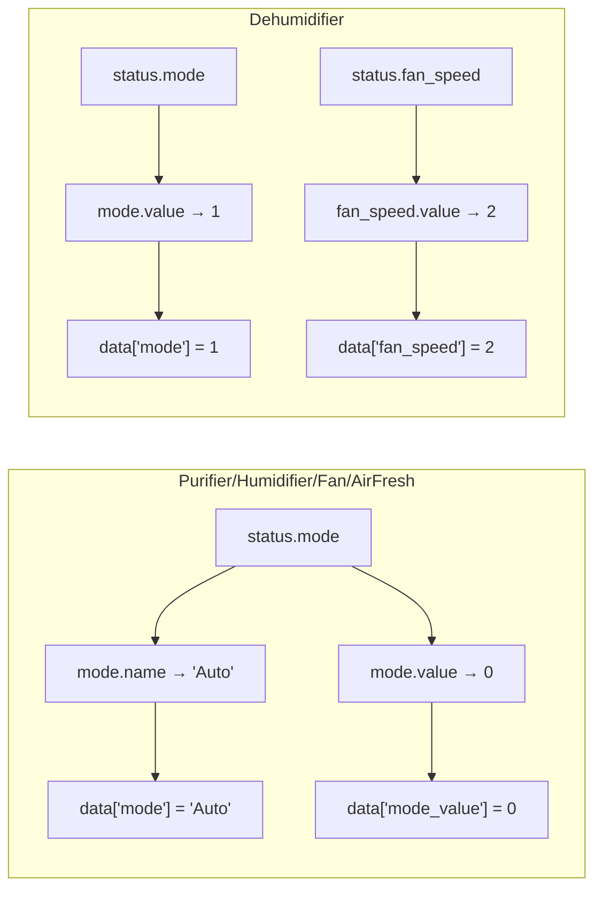

---

## 4. Группа 1: Air Purifier

### Поддерживаемые модели (20 моделей)

| Модель | ID | Протокол | Feature Flags | Operation Modes |
|--------|-----|----------|---------------|-----------------|
| Mi Air Purifier | V1 | miIO | BUZZER, CHILD_LOCK, LED, LED_BRIGHTNESS, FAVORITE_LEVEL, LEARN_MODE, RESET_FILTER, EXTRA_FEATURES | Auto, Silent, Favorite, Idle |
| Mi Air Purifier 2 | V2 | miIO | (default) | Auto, Silent, Favorite, Idle |
| Mi Air Purifier V3 | V3 | miIO | BUZZER, CHILD_LOCK, LED | Auto, Silent, Favorite, Idle, Medium, High, Strong |
| Mi Air Purifier Pro | V6 | miIO | CHILD_LOCK, LED, FAVORITE_LEVEL, AUTO_DETECT, VOLUME | Auto, Silent, Favorite |
| Mi Air Purifier Pro V7 | V7 | miIO | CHILD_LOCK, LED, FAVORITE_LEVEL, VOLUME | Auto, Silent, Favorite |
| Mi Air Purifier 2S | 2S | miIO | BUZZER, CHILD_LOCK, LED, FAVORITE_LEVEL | Auto, Silent, Favorite |
| Mi Air Purifier 2H | 2H | miIO | BUZZER, CHILD_LOCK, LED, FAVORITE_LEVEL, LED_BRIGHTNESS | Auto, Silent, Favorite, Idle |
| Mi Air Purifier 3/3H/ZA1 | MiOT | MiOT | BUZZER, CHILD_LOCK, LED, FAVORITE_LEVEL, FAN_LEVEL, LED_BRIGHTNESS | Auto, Silent, Favorite, Fan |
| AirDog X3/X5/X7SM | airdog | miIO | CHILD_LOCK | AirDogOperationMode enum |

### Управление скоростью (percentage)

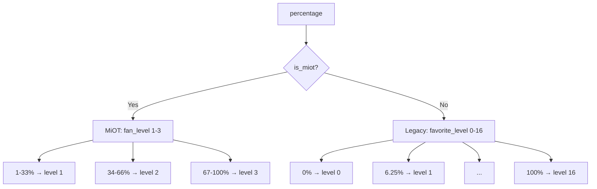

```python
# purifier.py:186-204
# MiOT: percentage → fan_level (1-3)
level = max(1, min(3, int(percentage / 33.33) + 1))
device.set_fan_level(level)

# Legacy: percentage → favorite_level (0-16)
level = int(percentage / 6.25)
device.set_favorite_level(level)
```

### Установка preset_mode

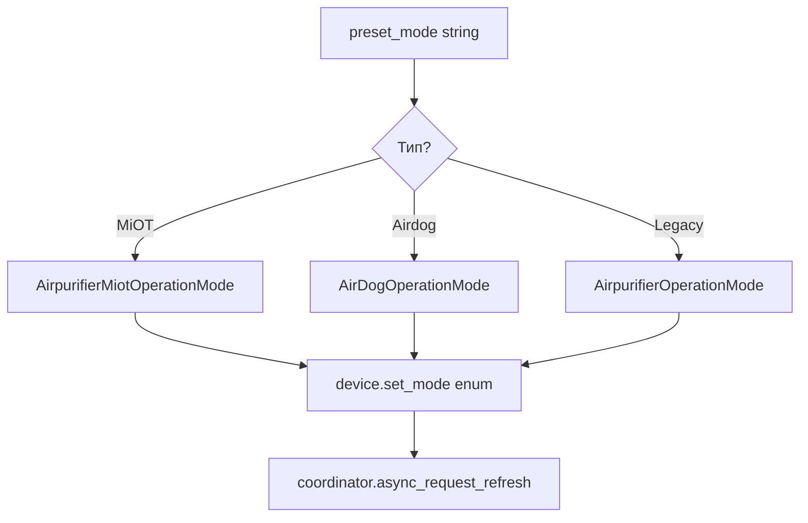

### Команды устройству (Air Purifier)

| Действие | Метод device | Параметр | Feature Flag |
|----------|-------------|----------|--------------|
| Включить | device.on() | — | — |
| Выключить | device.off() | — | — |
| Режим | device.set_mode(enum) | OperationMode | — |
| Скорость MiOT | device.set_fan_level(int) | 1-3 | FEATURE_SET_FAN_LEVEL |
| Скорость Legacy | device.set_favorite_level(int) | 0-16 | FEATURE_SET_FAVORITE_LEVEL |
| Buzzer | device.set_buzzer(bool) | True/False | FEATURE_SET_BUZZER |
| LED | device.set_led(bool) | True/False | FEATURE_SET_LED |
| LED Brightness | device.set_led_brightness(enum) | LedBrightness | FEATURE_SET_LED_BRIGHTNESS |
| Child Lock | device.set_child_lock(bool) | True/False | FEATURE_SET_CHILD_LOCK |
| Auto Detect | device.set_auto_detect(bool) | True/False | FEATURE_SET_AUTO_DETECT |
| Volume | device.set_volume(int) | 0-100 | FEATURE_SET_VOLUME |
| Reset Filter | device.reset_filter() | — | FEATURE_RESET_FILTER |

---

## 5. Группа 2: Air Humidifier

### Поддерживаемые модели (13 моделей)

| Подгруппа | Модели | python-miio | Feature Flags | Preset Modes |
|-----------|--------|-------------|---------------|-------------|
| **Zhimi V1** | V1 | AirHumidifier | BUZZER, CHILD_LOCK, LED, LED_BRIGHTNESS, TARGET_HUMIDITY | AirhumidifierOperationMode (без Auto) |
| **Zhimi CA/CB** | CA1, CB1, CB2 | AirHumidifier | + DRY | AirhumidifierOperationMode (без Strong) |
| **Zhimi CA4 (MiOT)** | CA4 | AirHumidifierMiot | BUZZER, CHILD_LOCK, LED_BRIGHTNESS, TARGET_HUMIDITY, DRY, MOTOR_SPEED, CLEAN_MODE | AirhumidifierMiotOperationMode |
| **Deerma MJJSQ** | MJJSQ, JSQ | AirHumidifierMjjsq | BUZZER, LED, TARGET_HUMIDITY | AirhumidifierMjjsqOperationMode (без WetAndProtect) |
| **Deerma JSQ1** | JSQ1 | AirHumidifierMjjsq | + WET_PROTECTION | AirhumidifierMjjsqOperationMode (с WetAndProtect) |
| **Deerma JSQ5** | JSQ3, JSQ5 | AirHumidifierJsqs | BUZZER, LED, TARGET_HUMIDITY | AirhumidifierJsqsOperationMode |
| **Deerma JSQS** | JSQ2W, JSQS | AirHumidifierJsqs | + WET_PROTECTION | AirhumidifierJsqsOperationMode |
| **Shuii JSQ001** | JSQ001 | AirHumidifierJsq | BUZZER, LED, LED_BRIGHTNESS, CHILD_LOCK | AirhumidifierJsqOperationMode |

### Особенности реализации

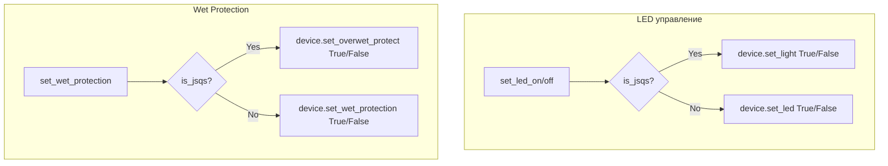

### Нормализация атрибута humidity

```python
# coordinator.py:202-206 — XiaomiAirHumidifierCoordinator
# Разные модели возвращают humidity под разными именами
if hasattr(status, "humidity"):
    data["humidity"] = status.humidity          # Zhimi модели
elif hasattr(status, "relative_humidity"):
    data["humidity"] = status.relative_humidity  # Deerma JSQS модели
```

---

## 6. Группа 3: Air Fresh

### Поддерживаемые модели (4 модели)

| Модель | ID | python-miio | Feature Flags | Preset Modes |
|--------|-----|-------------|---------------|-------------|
| Air Fresh VA2 | VA2 | AirFresh | BUZZER, CHILD_LOCK, LED, LED_BRIGHTNESS, RESET_FILTER, EXTRA_FEATURES | Auto, Silent, Interval, Low, Middle, Strong |
| Air Fresh VA4 | VA4 | AirFresh | + PTC | Auto, Silent, Interval, Low, Middle, Strong |
| Air Fresh A1 | A1 | AirFreshA1 | BUZZER, CHILD_LOCK, LED, RESET_FILTER, PTC, FAVORITE_SPEED | Auto, Sleep, Favorite |
| Air Fresh T2017 | T2017 | AirFreshT2017 | + PTC_LEVEL, DISPLAY_ORIENTATION | Auto, Sleep, Favorite |

### Особенности T2017

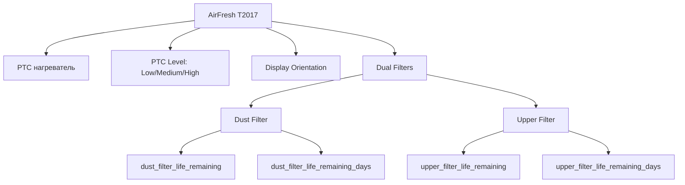

### Команды

| Действие | Метод | T2017 | A1 | VA2/VA4 |
|----------|-------|-------|-----|---------|
| PTC вкл/выкл | device.set_ptc(bool) | + | + | VA4 only |
| PTC уровень | device.set_ptc_level(enum) | + | - | - |
| Display orientation | device.set_display_orientation(enum) | + | - | - |
| Reset filter | device.reset_filter() | + (dual) | + | + |
| Favorite speed | device.set_favorite_speed(int) | + | + | - |

---

## 7. Группа 4: Standing Fan

### Поддерживаемые модели (14 моделей)

| Подгруппа | Модели | python-miio | Скорость | Oscillation | Natural Mode |
|-----------|--------|-------------|----------|-------------|-------------|
| **1C-style** | 1C, P8 | Fan1C | Discrete 3 levels | + | + |
| **P5** | P5 | FanP5 | Percentage (P5 values) | + | + |
| **MiOT** | P9, P10, P11, P18 | FanMiot | Percentage | + | + |
| **Leshow** | SS4 | FanLeshow | FanLeshowOperationMode | - | - |
| **Legacy** | V2, V3, SA1, ZA1, ZA3, ZA4 | Fan | Percentage | + | + |

### Управление скоростью

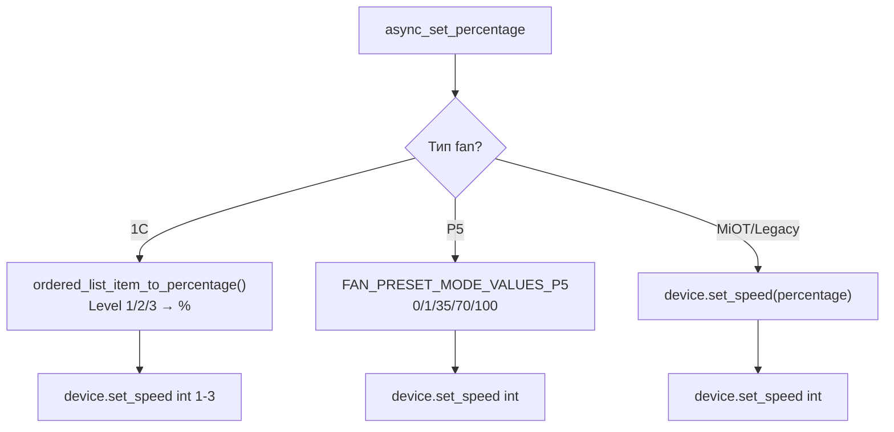

### Oscillation и Natural Mode

```python
# standing.py — определение natural mode (property, синхронизируется с coordinator)
@property
def _is_natural_mode(self) -> bool:
    if self._is_p5_style:
        return self.coordinator.data.get("mode") == "Nature"
    # Legacy: natural_speed > 0 означает natural mode
    natural_speed = self.coordinator.data.get("natural_speed")
    return bool(natural_speed and natural_speed > 0)

# standing.py — natural mode (отличия по моделям)
async def async_set_natural_mode_on(self):
    if self._is_p5_style:
        await device.set_mode(FanOperationMode.Nature)  # Через enum
    else:
        await device.set_natural_speed(speed)  # Через скорость
```

### Delay Off — различие единиц измерения

```python
# standing.py — ВНИМАНИЕ: разные единицы!
async def async_set_delay_off(self, delay_off_countdown: int):
    if self._is_p5_style or self._is_leshow:
        # P5 и Leshow: передаём минуты как есть
        await device.set_delay_off(delay_off_countdown)
    else:
        # Legacy: конвертируем минуты → секунды
        await device.set_delay_off(delay_off_countdown * 60)
```

---

## 8. Группа 5: Air Dehumidifier

### Одна модель: nwt.derh.wdh318efw1

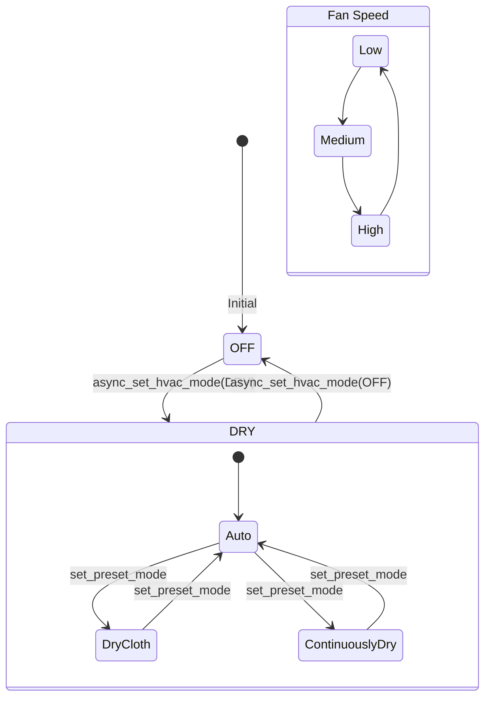

### Свойства и команды

| Property | Источник данных | Тип |
|----------|----------------|-----|
| hvac_mode | coordinator.data["power"] | HVACMode.DRY / OFF |
| current_humidity | coordinator.data["humidity"] | int |
| target_humidity | coordinator.data["target_humidity"] | int |
| preset_mode | coordinator.data["mode"] (строка через _parse_mode) | str (enum name) |
| fan_mode | coordinator.data["fan_speed"] (строка через coordinator) | str (enum name) |

### Установка целевой влажности (двухшаговая операция)

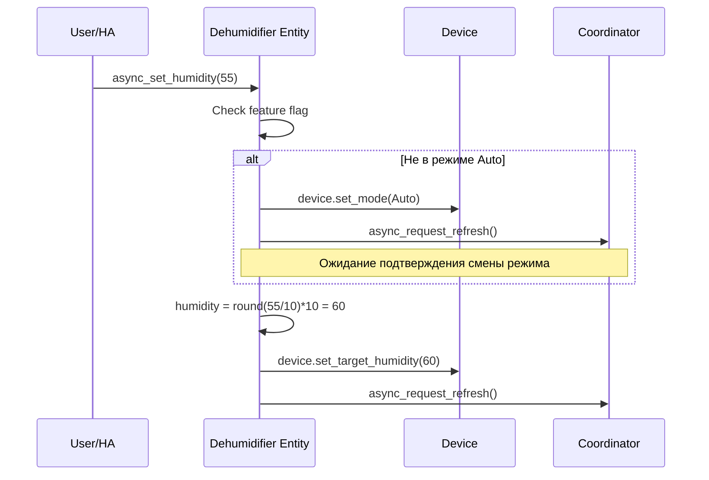

### Fan modes фильтрация

```python
# dehumidifier.py:62-67 — исключены Sleep и Strong из fan_modes
self._attr_fan_modes = [
    mode.name
    for mode in AirdehumidifierFanSpeed
    if mode not in [AirdehumidifierFanSpeed.Sleep, AirdehumidifierFanSpeed.Strong]
]
```

---

## 9. Вспомогательные entities

### Общая архитектура

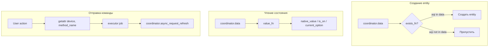

### Sensor entities

| Сенсор | key | value_fn | Устройства |
|--------|-----|----------|-----------|
| Temperature | temperature | data["temperature"] | Все |
| Humidity | humidity | data["humidity"] | Все |
| AQI | aqi | data["aqi"] | Purifier, AirFresh |
| PM2.5 | pm25 | data["pm25"] | AirFresh A1/T2017 |
| PM10 | pm10 | data["pm10"] | Purifier (с pm10_density) |
| CO2 | co2 | data["co2"] | AirFresh |
| Filter Life | filter_life_remaining | data["filter_life_remaining"] | Purifier, AirFresh |
| Filter Hours | filter_hours_used | data["filter_hours_used"] | Purifier, AirFresh |
| Motor Speed | motor_speed | data["motor_speed"] | Purifier, Humidifier |
| Use Time | use_time | data["use_time"] | Purifier, Humidifier, Fan |
| Illuminance | illuminance | data["illuminance"] | Purifier Pro |
| TVOC | tvoc | data["tvoc"] | Purifier MiOT |
| Water Level | water_level | data["water_level"] | Humidifier |

### Switch entities

| Switch | key | turn_on_fn | turn_off_fn | Устройства |
|--------|-----|-----------|------------|-----------|
| Buzzer | buzzer | set_buzzer(True) | set_buzzer(False) | Все с FEATURE_SET_BUZZER |
| LED | led | set_led(True) | set_led(False) | Все с FEATURE_SET_LED |
| Child Lock | child_lock | set_child_lock(True) | set_child_lock(False) | Все с FEATURE_SET_CHILD_LOCK |
| Auto Detect | auto_detect | set_auto_detect(True) | set_auto_detect(False) | Purifier Pro |
| Learn Mode | learn_mode | set_learn_mode(True) | set_learn_mode(False) | Purifier V1-V2 |
| Dry Mode | dry | set_dry(True) | set_dry(False) | Humidifier CA/CB |
| Clean Mode | clean_mode | set_clean_mode(True) | set_clean_mode(False) | Humidifier CA4 |
| PTC | ptc | set_ptc(True) | set_ptc(False) | AirFresh VA4/T2017 |

### Number entities

| Number | key | Min | Max | set_fn | Устройства |
|--------|-----|-----|-----|--------|-----------|
| Favorite Level | favorite_level | 0 | 16 | set_favorite_level | Purifier Legacy |
| Fan Level | fan_level | 1 | 3 | set_fan_level | Purifier MiOT |
| Volume | volume / buzzer_volume | 0 | 100 | set_volume | Purifier Pro |
| Motor Speed | motor_speed | 200 | 2000 | set_motor_speed | Humidifier CA4 |
| Target Humidity | target_humidity | 30 | 80 | set_target_humidity | Humidifier |
| Favorite Speed | favorite_speed | 60 | 300 | set_favorite_speed | AirFresh T2017/A1 |

### Select entities

| Select | key | Options | Устройства |
|--------|-----|---------|-----------|
| LED Brightness | led_brightness | bright/dim/off | Purifier, Fan |
| PTC Level | ptc_level | Low/Medium/High | AirFresh T2017 |
| Display Orientation | display_orientation | Portrait/LandscapeLeft/LandscapeRight | AirFresh T2017 |
| Operation Mode | mode (XiaomiMiioModeSelect) | Per-model enum | Все |

### Button entities

| Button | key | press_fn | Устройства |
|--------|-----|----------|-----------|
| Reset Filter | reset_filter | reset_filter() | Purifier, AirFresh |
| Filters Cleaned | filters_cleaned | filters_cleaned() | Humidifier |

### Binary Sensor entities

| Binary Sensor | key | value_fn | Устройства |
|---------------|-----|----------|-----------|
| Water Tank | water_tank | data["tank_filed"] | Humidifier |
| No Water | no_water | data["no_water"] | Humidifier |
| Water Tank Detached | water_tank_detached | data["water_tank_detached"] | Humidifier |

---

## 10. Обработка внешних изменений

### Как интеграция обнаруживает изменения от других инструментов

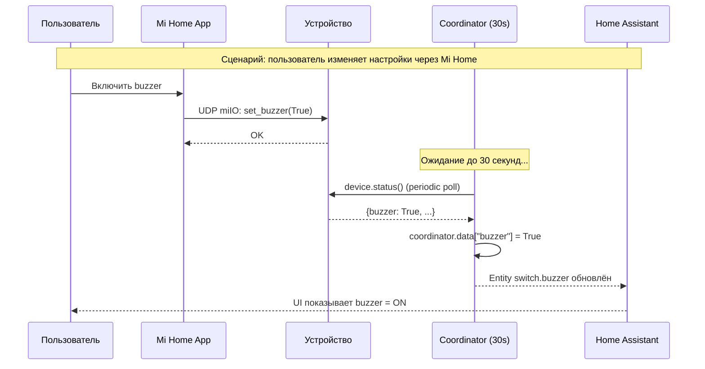

### Механизм обнаружения

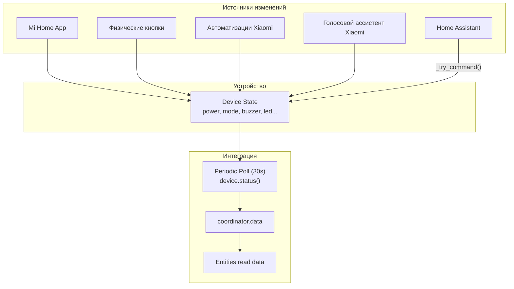

### Ключевые характеристики

| Параметр | Значение |
|----------|----------|
| **Протокол** | UDP miIO (pull-based, нет push-уведомлений) |
| **Интервал poll** | 30 секунд (настраивается 10-300с) |
| **Задержка обнаружения** | 0-30 секунд (зависит от фазы цикла) |
| **Немедленное обновление** | Только после команд HA (async_request_refresh) |
| **always_update** | False (обновляет entities только при изменении данных) |
| **Optimistic state** | Да, для turn_on/turn_off (мгновенное обновление UI) |

### Сценарии синхронизации

#### Сценарий 1: Команда из HA

```
t=0    HA → device.set_mode(Auto)         → команда отправлена
t=0.1  HA → coordinator.async_request_refresh()  → немедленный poll
t=0.3  device.status() → новый mode=Auto   → coordinator.data обновлён
t=0.3  UI обновлён
```
**Задержка: ~0.3 секунды**

#### Сценарий 2: Команда из Mi Home

```
t=0    Mi Home → device.set_mode(Silent)  → команда отправлена
t=0    Device state changed
...
t=15   coordinator poll → device.status()  → mode=Silent
t=15   UI обновлён
```
**Задержка: 0-30 секунд**

#### Сценарий 3: Физическая кнопка

```
t=0    User presses button on device
t=0    Device state changed internally
...
t=25   coordinator poll → device.status()  → power=off
t=25   UI обновлён
```
**Задержка: 0-30 секунд**

### Optimistic state update

Для команд turn_on/turn_off используется optimistic update — state обновляется немедленно после успешной отправки команды, не дожидаясь poll:

```python
# Паттерн в base fan и dehumidifier:
async def async_turn_on(self):
    result = await self._try_command("...", self.coordinator.device.on)
    if result and self.coordinator.data is not None:
        self.coordinator.data["power"] = "on"    # Optimistic update
        self.async_write_ha_state()               # Немедленное обновление UI
    await self.coordinator.async_request_refresh() # Подтверждение от устройства
```

---

## 11. Открытые проблемы и архитектурные замечания

### P3: Entities создаются на основе первого poll — неполные данные

**Файл:** `sensor.py`, `switch.py`, `number.py` и др.

**Проблема:** Entity creation использует `exists_fn(coordinator.data)` на основе данных первого poll. Если устройство при первом запросе вернуло неполные данные (например, некоторые атрибуты = None и не включены в ответ), соответствующие entities НЕ будут созданы и не появятся до перезагрузки интеграции.

```python
# sensor.py
for description in SENSOR_DESCRIPTIONS:
    if description.exists_fn(coordinator.data):      # Проверяет ОДИН раз!
        entities.append(XiaomiMiioSensor(coordinator, description))
```

**Рекомендация:** Либо создавать все entities по feature flags модели (а не по данным), либо реализовать dynamic entity discovery при обновлениях coordinator.

### A3: Дублирование service_mixin и platform entities

Сервисы определены в `service_mixin.py` (DeviceServiceMixin) и регистрируются в `fan.py`/`climate.py`.
Параллельно, `switch.py`, `number.py`, `select.py` предоставляют стандартные HA entities для тех же настроек.

Пользователь может изменить buzzer через:
- Switch entity `switch.buzzer`
- Service call `fan_set_buzzer_on`

**Рекомендация:** Документировать, что services являются legacy и рекомендуется использовать entity-based управление.

### Ранее исправленные проблемы

| ID | Описание | Статус |
|----|----------|--------|
| P1 | Race condition в dehumidifier.async_set_humidity() | ✅ Добавлен refresh между set_mode и set_target_humidity |
| P2 | Непоследовательная обработка mode enum в dehumidifier | ✅ Унифицировано через _parse_mode() |
| P4 | Concurrent commands / UDP flood | ✅ HA Core уже дебаунсит async_request_refresh() |
| P5 | _natural_mode не синхронизируется с coordinator | ✅ Заменён на property _is_natural_mode из coordinator.data |
| P6 | Тихий NOP для неподдерживаемых сервисов | ✅ Добавлен _check_feature() с debug-логированием |
| P7 | Нет warning при fallback unique_id | ✅ Добавлен _LOGGER.warning |
| A1 | always_update=True | ✅ Убрано, используется default (False) |
| A2 | Нет optimistic state update | ✅ Добавлен для turn_on/turn_off |
| A4 | Отсутствие TypedDict для coordinator.data | ✅ Добавлены TypedDict для всех координаторов |
| A5 | Дублирование classify model | ✅ DeviceCategory enum + classify_model() |
| A6 | Дублирование service-методов | ✅ DeviceServiceMixin |

---

## Приложение: Feature Flags матрица

```
Модель                  BUZ LED CHL LBR FAV AUT LRN VOL RST EXT TGH DRY OSC NAT FLV MOT PTC PTL FSP DOR WET CLN
─────────────────────── ─── ─── ─── ─── ─── ─── ─── ─── ─── ─── ─── ─── ─── ─── ─── ─── ─── ─── ─── ─── ─── ───
Purifier Default         +   +   +   +   +   .   +   .   +   +   .   .   .   .   .   .   .   .   .   .   .   .
Purifier Pro             .   +   +   .   +   +   .   +   .   .   .   .   .   .   .   .   .   .   .   .   .   .
Purifier Pro V7          .   +   +   .   +   .   .   +   .   .   .   .   .   .   .   .   .   .   .   .   .   .
Purifier 2S              +   +   +   .   +   .   .   .   .   .   .   .   .   .   .   .   .   .   .   .   .   .
Purifier 2H              +   +   +   +   +   .   .   .   .   .   .   .   .   .   .   .   .   .   .   .   .   .
Purifier 3/MiOT          +   +   +   +   +   .   .   .   .   .   .   .   .   .   +   .   .   .   .   .   .   .
Purifier V3              +   +   +   .   .   .   .   .   .   .   .   .   .   .   .   .   .   .   .   .   .   .
Purifier AirDog          .   .   +   .   .   .   .   .   .   .   .   .   .   .   .   .   .   .   .   .   .   .
Humidifier Default       +   +   +   +   .   .   .   .   .   .   +   .   .   .   .   .   .   .   .   .   .   .
Humidifier CA/CB         +   +   +   +   .   .   .   .   .   .   +   +   .   .   .   .   .   .   .   .   .   .
Humidifier CA4           +   .   +   +   .   .   .   .   .   .   +   +   .   .   .   +   .   .   .   .   .   +
Humidifier MJJSQ         +   +   .   .   .   .   .   .   .   .   +   .   .   .   .   .   .   .   .   .   .   .
Humidifier JSQ1          +   +   .   .   .   .   .   .   .   .   +   .   .   .   .   .   .   .   .   .   +   .
Humidifier JSQ5          +   +   .   .   .   .   .   .   .   .   +   .   .   .   .   .   .   .   .   .   .   .
Humidifier JSQS          +   +   .   .   .   .   .   .   .   .   +   .   .   .   .   .   .   .   .   .   +   .
Humidifier JSQ           +   +   +   +   .   .   .   .   .   .   .   .   .   .   .   .   .   .   .   .   .   .
AirFresh Default         +   +   +   +   .   .   .   .   +   +   .   .   .   .   .   .   .   .   .   .   .   .
AirFresh VA4             +   +   +   +   .   .   .   .   +   +   .   .   .   .   .   .   +   .   .   .   .   .
AirFresh A1              +   +   +   .   .   .   .   .   +   .   .   .   .   .   .   .   +   .   +   .   .   .
AirFresh T2017           +   +   +   .   .   .   .   .   +   .   .   .   .   .   .   .   +   +   +   +   .   .
Fan Default              +   .   +   +   .   .   .   .   .   .   .   .   +   +   .   .   .   .   .   .   .   .
Fan P5                   +   +   +   .   .   .   .   .   .   .   .   .   +   +   .   .   .   .   .   .   .   .
Fan Leshow SS4           +   .   .   .   .   .   .   .   .   .   .   .   .   .   .   .   .   .   .   .   .   .
Fan 1C                   +   .   +   +   .   .   .   .   .   .   .   .   +   +   .   .   .   .   .   .   .   .
Dehumidifier             +   +   +   .   .   .   .   .   .   .   +   .   .   .   .   .   .   .   .   .   .   .
```

Легенда: BUZ=Buzzer, LED=LED, CHL=ChildLock, LBR=LEDBrightness, FAV=FavoriteLevel, AUT=AutoDetect, LRN=LearnMode, VOL=Volume, RST=ResetFilter, EXT=ExtraFeatures, TGH=TargetHumidity, DRY=Dry, OSC=Oscillation, NAT=NaturalMode, FLV=FanLevel, MOT=MotorSpeed, PTC=PTC, PTL=PTCLevel, FSP=FavoriteSpeed, DOR=DisplayOrientation, WET=WetProtection, CLN=CleanMode
